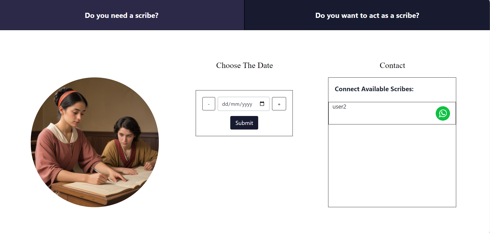

## ClassMate

This Peer-to-Peer Skill Connect Platform for college students helps them connect based on shared skills. Students register, add their skills, and can search for others with specific skills to connect with them. Additionally, the platform includes a scribe selection feature for physically challeneged students by which they could post a scribe request and if any other can accept it .

## Sign In

## Register 

## Profile 

## Landing Page

    
    
   

## Skill Search

## Scribe Request

## Scribe Accept

